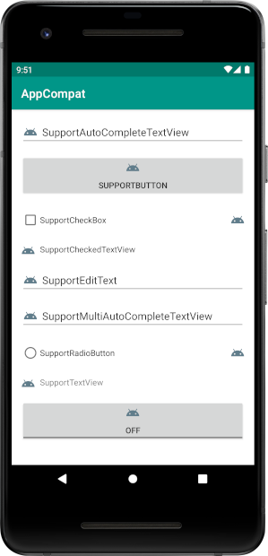
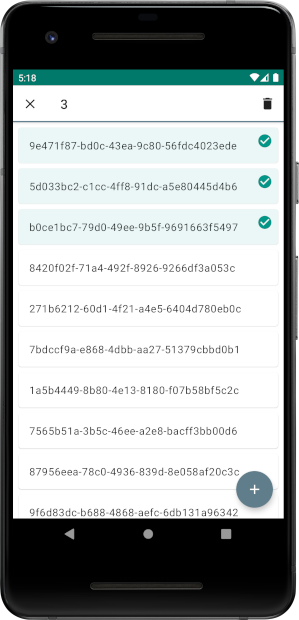

# Support

This project is a suite of libraries for Android.

## appcompat

[](https://search.maven.org/artifact/com.kfaraj.support/appcompat)

This library is built on top of the [AndroidX AppCompat library](https://developer.android.com/jetpack/androidx/releases/appcompat) and is designed to be used with Android 4.0 (API level 14) and higher.

It adds support for compound drawables tint to the following classes:
- [SupportAutoCompleteTextView](appcompat/src/main/java/com/kfaraj/support/widget/SupportAutoCompleteTextView.java)
- [SupportButton](appcompat/src/main/java/com/kfaraj/support/widget/SupportButton.java)
- [SupportCheckBox](appcompat/src/main/java/com/kfaraj/support/widget/SupportCheckBox.java)
- [SupportCheckedTextView](appcompat/src/main/java/com/kfaraj/support/widget/SupportCheckedTextView.java)
- [SupportEditText](appcompat/src/main/java/com/kfaraj/support/widget/SupportEditText.java)
- [SupportMultiAutoCompleteTextView](appcompat/src/main/java/com/kfaraj/support/widget/SupportMultiAutoCompleteTextView.java)
- [SupportRadioButton](appcompat/src/main/java/com/kfaraj/support/widget/SupportRadioButton.java)
- [SupportTextView](appcompat/src/main/java/com/kfaraj/support/widget/SupportTextView.java)
- [SupportToggleButton](appcompat/src/main/java/com/kfaraj/support/widget/SupportToggleButton.java)

```kotlin
val textView = SupportTextView(context)
textView.supportCompoundDrawableTintList = tint
textView.supportCompoundDrawableTintMode = tintMode
```

```xml
<com.kfaraj.support.widget.SupportTextView
    android:layout_width="wrap_content"
    android:layout_height="wrap_content"
    app:drawableTint="@color/tint"
    app:drawableTintMode="multiply" />
```

This library can be included with the following dependencies:
```groovy
implementation 'com.kfaraj.support:appcompat:3.1.5'
```

## appcompat-sample

This sample app demonstrates how to use the [AppCompat library](#appcompat).



## recyclerview

[](https://search.maven.org/artifact/com.kfaraj.support/recyclerview)

This library is built on top of the [AndroidX RecyclerView library](https://developer.android.com/jetpack/androidx/releases/recyclerview) and is designed to be used with Android 4.0 (API level 14) and higher.

It adds support for empty view, item click and choice mode to the following class:
- [SupportRecyclerView](recyclerview/src/main/java/com/kfaraj/support/widget/SupportRecyclerView.java)

```kotlin
val recyclerView = SupportRecyclerView(context)
recyclerView.emptyView = emptyView
recyclerView.onItemClickListener = onItemClickListener
recyclerView.onItemLongClickListener = onItemLongClickListener
recyclerView.choiceMode = choiceMode
recyclerView.multiChoiceModeListener = multiChoiceModeListener
```

```xml
<com.kfaraj.support.widget.SupportRecyclerView
    android:layout_width="match_parent"
    android:layout_height="match_parent"
    app:choiceMode="singleChoice" />
```

This library can be included with the following dependencies:
```groovy
implementation 'com.kfaraj.support:recyclerview:3.0.6'
```

## recyclerview-sample

This sample app demonstrates how to use the [RecyclerView library](#recyclerview).


