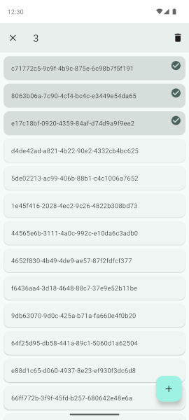

# Support

This project is a suite of libraries for Android.

## AppCompat

[](https://search.maven.org/artifact/com.kfaraj.support/appcompat)

This library is built on top of the
[AndroidX AppCompat library](https://developer.android.com/jetpack/androidx/releases/appcompat) and
is designed to be used with Android 4.0 (API level 14) and higher.

It can be included with the following dependencies:

```groovy
implementation 'com.kfaraj.support:appcompat:4.0.0'
```

## RecyclerView

[](https://search.maven.org/artifact/com.kfaraj.support/recyclerview)

This library is built on top of the
[AndroidX RecyclerView library](https://developer.android.com/jetpack/androidx/releases/recyclerview)
and is designed to be used with Android 4.0 (API level 14) and higher.

It can be included with the following dependencies:

```groovy
implementation 'com.kfaraj.support:recyclerview:3.0.9'
```

It adds support for empty view, item click and choice mode to the following classes:

- [SupportRecyclerView](recyclerview/src/main/java/com/kfaraj/support/widget/SupportRecyclerView.java)

```kotlin
val recyclerView = SupportRecyclerView(context)
recyclerView.emptyView = emptyView
recyclerView.onItemClickListener = onItemClickListener
recyclerView.onItemLongClickListener = onItemLongClickListener
recyclerView.choiceMode = choiceMode
recyclerView.multiChoiceModeListener = multiChoiceModeListener
```

```xml
<com.kfaraj.support.widget.SupportRecyclerView
    android:layout_width="match_parent"
    android:layout_height="match_parent"
    app:choiceMode="singleChoice" />
```

## RecyclerView sample

This sample app demonstrates how to use the [RecyclerView library](#recyclerview).


