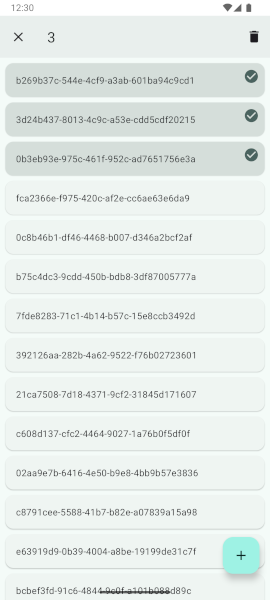

# RecyclerView

[](https://search.maven.org/artifact/com.kfaraj.support.recyclerview/recyclerview)

This library provides additional support for the
[AndroidX RecyclerView library](https://developer.android.com/jetpack/androidx/releases/recyclerview).

It can be included with the following dependencies:

```kotlin
implementation("com.kfaraj.support.recyclerview:recyclerview:4.0.0")
```

It adds support for empty view, item click and choice mode with the following classes:

- [SupportRecyclerView](recyclerview/src/main/java/com/kfaraj/support/recyclerview/widget/SupportRecyclerView.java)

```kotlin
val recyclerView = SupportRecyclerView(context)
recyclerView.emptyView = emptyView
recyclerView.onItemClickListener = onItemClickListener
recyclerView.onItemLongClickListener = onItemLongClickListener
recyclerView.choiceMode = choiceMode
recyclerView.multiChoiceModeListener = multiChoiceModeListener
```

```xml
<com.kfaraj.support.recyclerview.widget.SupportRecyclerView
    android:layout_width="match_parent"
    android:layout_height="match_parent"
    app:choiceMode="singleChoice" />
```


